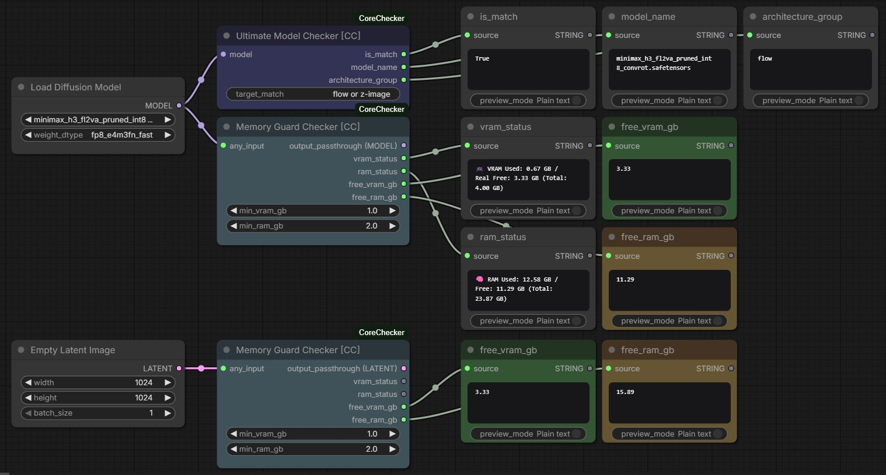
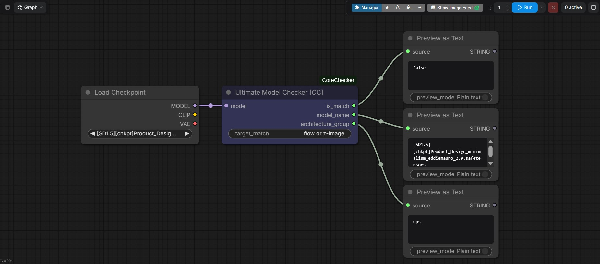
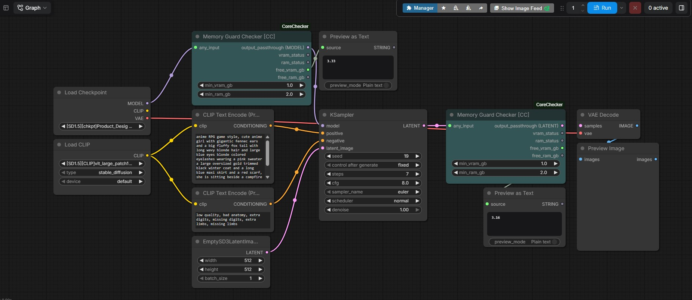
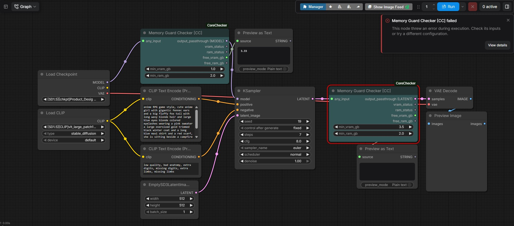

# ComfyUI CoreChecker Pack

A collection of lightweight, robust custom nodes for ComfyUI designed to optimize workflows through smart conditional logic and system resource awareness.

This pack includes three core nodes:
1. **Ultimate Model Checker** – Identifies model variants and filters processing pipelines using advanced multi-keyword logic.
2. **Memory Guard Checker** – Monitors system memory (RAM) and graphics memory (VRAM) usage at specific execution steps with zero external dependencies.
3. **Safe Memory Brake** – An active background monitor that utilizes the ComfyUI HTTP API to prevent sudden out-of-memory crashes by gracefully intercepting the execution queue.



---

## 📦 Installation & Setup

To ensure these nodes are registered cleanly without clashing with ComfyUI's main environment, organize them under a single custom node directory:

1. Navigate to your ComfyUI custom nodes directory: `ComfyUI/custom_nodes/`
2. Create a folder named `ComfyUI-CoreChecker`
3. Place `UltimateModelChecker.py`, `memoryGuardChecker.py`, and `SafeMemoryBrake.py` inside it.
4. Create a file named `__init__.py` in the same folder and add the following code:

```python
# ดึงข้อมูลการลงทะเบียนโหนดมาจากไฟล์เดี่ยวทั้ง 3 ตัวด้านใน
from .ultimateModelChecker import UltimateModelChecker
from .memoryGuardChecker import MemoryGuardChecker
from .SafeMemoryBrake import SafeMemoryBrakeNode

# รวมร่างช่องทางการเรียกใช้งานโหนดทั้งหมดส่งไปให้ ComfyUI หลักรันระบบ
NODE_CLASS_MAPPINGS = {
    "UltimateModelChecker": UltimateModelChecker,
    "MemoryGuardChecker": MemoryGuardChecker,
    "SafeMemoryBrake": SafeMemoryBrakeNode
}

NODE_DISPLAY_NAME_MAPPINGS = {
    "UltimateModelChecker": "Ultimate Model Checker [CC]",
    "MemoryGuardChecker": "Memory Guard Checker [CC]",
    "SafeMemoryBrake": "Safe Brake Node Checker [CC]"
}

__all__ = ['NODE_CLASS_MAPPINGS', 'NODE_DISPLAY_NAME_MAPPINGS']
```

5. Restart your ComfyUI backend.

---

# 🛑 1. ComfyUI Ultimate Model Checker

<a href='./img/workflow-ulltimateModelChecker.png' download>download workflow</a>


A comprehensive, production-grade custom node for ComfyUI designed to analyze and identify diffusion model architectures dynamically. It processes models recursively to extract metadata, classifies them into distinct mathematical diffusion groups, and runs complex multi-condition keyword routing (**AND/OR logic**) to control your workflow pipeline.

---

## 🚀 Key Features

* **Recursive Model Inspection**: Automatically unwraps up to 3 layers of object wrappers to access raw inner properties (`model_type`, `model_config`, `latent_format`).
* **Upstream Filename Resolution**: Traces prompt lineage to extract the actual loaded filename (`unet_name` or `ckpt_name`) from preceding nodes via `unique_id`.
* **Advanced Architecture Grouping**: Classifies models into 4 distinct core groups based on mathematical design:
  1. **`flow`** (Flow Matching / SD3 / Flux / Cosmos / Wan / Hunyuan / MiniMax)
  2. **`lcm`** (Latent Consistency / Speed Distilled / Hyper-SD / TCD)
  3. **`v`** (Velocity Prediction / SVD / CosXL)
  4. **`eps`** (Traditional Epsilon Noise Prediction - auto-detects SD1.5 vs SDXL architectures).
* **Flexible Logic Engine**: Evaluates user queries using flexible condition operators like `and` / `+` or `or` / `,` against the extracted filename and architecture type.

---

## 🎛️ Node Inputs & Outputs

### Inputs
* **`model`** (`MODEL`): The incoming model stream directly from a Load Checkpoint or Load UNET node.
* **`target_match`** (`STRING`): The search text criteria. Supports logical evaluation. (Default: `"flow or z-image"`)

### Outputs
* **`is_match`** (`BOOLEAN`): Returns `True` if the query matches the model properties; otherwise `False`. Excellent for driving switches or router nodes.
* **`model_name`** (`STRING`): The resolved filename of the model (e.g., `flux1-dev.safetensors`).
* **`architecture_group`** (`STRING`): The classified mathematical framework label (e.g., `flow`, `lcm`, `v`, or detailed `eps`).

---

## 💡 How it Works Under the Hood

The node checks both the **Model Name** and the calculated **Architecture Group**, joining them into a unified search pool. 

### 1. OR Logic Rules (`or` or `,`)
If your target contains `or` or commas, the engine checks if **ANY** of the terms exist in the model properties.
* *Example*: `flux or pony` -> Matches if the model filename contains "pony" OR if its group is "flow" (Flux framework).

### 2. AND Logic Rules (`and` or `+`)
If your target contains `and` or plus symbols, the engine strictly ensures **ALL** terms are present.
* *Example*: `eps and pony` -> Only matches if the model is classified as an Epsilon model AND the filename contains "pony".

---

## 📋 Comprehensive Usage Examples

### Example 1: Route Workflow via Switch Nodes (Conditional Execution)
You can route your pipelines conditionally based on whether a Flow-Matching model (like Flux) is being used.

1. Connect your **Load Checkpoint** node output into the `model` input of **Ultimate Model Checker**.
2. Set `target_match` to: `flow`
3. Connect the `is_match` (`BOOLEAN`) output to a **Conditional Switch** node (e.g., *ByteFlow Switch* or *Impact Pack's Switch*).
4. **Behavior**: If you load `flux1-dev.safetensors`, the architecture is evaluated as `flow`. `is_match` becomes `True`, turning on the Flux-specific path of your prompt or latent settings.

### Example 2: Distinguishing Hyper-SD / Lightning and LCM Models
To isolate fast-inference models and apply specific sampler settings (like low step counts):

1. Set `target_match` to: `lcm or lightning or hyper-sd`
2. **Behavior**: The node scans internal config flags or looks for keywords in the file name. If detected, it labels it as `lcm`. The `is_match` output returns `True`, allowing you to safely trigger a low-step scheduler downstream.

### Example 3: Dual Filtering Using AND Logic
If you want a pipeline block to activate exclusively for an SDXL Epsilon-style anime merge:

1. Set `target_match` to: `sdxl and pony`
2. **Behavior**: If the model is standard SD1.5 or pure Flux, it fails. It returns `True` only when the filename contains `pony` AND the model structure registers as `Epsilon (eps) [SDXL 1.0...]`.

---

## 🚨 Error Resilience

This node uses heavily isolated `try-except` blocks. If it runs on a heavily compressed custom pipeline or an completely untrackable wrapper, it gracefully fails back to:
* `model_name`: `"Unknown_Model"`
* `architecture_group`: `"Epsilon (eps) [Traditional Noise Prediction (Default Fallback)]"`

This ensures that even if deep inspection fails, **the ComfyUI execution queue never breaks or throws a red screen error.**

---
<br>
<br>
<br>


# 🔍 2. ComfyUI Memory Guard Checker

<a href='./img/workflow-memoryGuardChecker.png' download>download workflow</a>


A robust, cross-platform custom node for ComfyUI designed to act as a **Memory Guard**. It monitors your Graphics Memory (VRAM) and System Memory (RAM) in real-time right at its specific execution step. If the available resources drop below your defined safety thresholds, it automatically triggers a strict protection halt. This prevents Windows from swapping memory to the Pagefile (which causes extreme PC lag) and completely eliminates Out-Of-Memory (OOM) crashes.

---

## 🚀 Key Features

* **Real-time Driver-Level Monitoring**: Uses native `torch.cuda.mem_get_info()` to fetch the exact available and total VRAM directly from the NVIDIA driver.
* **Cross-Platform API Support**: 
  * **Windows**: Interfaces directly with the OS kernel via `ctypes` and `kernel32.GlobalMemoryStatusEx` to read detailed accurate hardware states.
  * **Linux**: Parses `/proc/meminfo` dynamically to support Cloud, Docker, and RunPod environments seamlessly.
* **Proactive VRAM Cleanup**: Automatically executes `torch.cuda.empty_cache()` during evaluation to release fragmented PyTorch cache from previous processing steps.
* **Dynamic Frontend Passthrough**: Features a true frontend-driven wildcard slot. The output type dynamically mutates to match whatever data type is connected to the input.
* **Unified Exception Halt**: Utilizes an explicit `ValueError` that stops ComfyUI execution instantly, pops up a detailed error box on the screen, and logs the precise system status.

---

## 🎛️ Node Inputs & Outputs

### Inputs
* **`any_input`** (`*`): A wildcard passthrough slot. Connect *any* data type here (e.g., `MODEL`, `LATENT`, `IMAGE`, `CONDITIONING`) to force the node to execute at a specific chronological point in your workflow.
* **`min_vram_gb`** (`FLOAT`): The minimum allowed free VRAM in Gigabytes before triggering a safety stop. (Default: `1.0`, Min: `0.0`, Max: `128.0`).
* **`min_ram_gb`** (`FLOAT`): The minimum allowed free System RAM in Gigabytes before triggering a safety stop. (Default: `2.0`, Min: `0.0`, Max: `256.0`).

### Outputs
* **`output_passthrough`** (`*`): Outputs the exact same object passed into `any_input` with zero modification.
* **`vram_status`** (`STRING`): A detailed formatted text report showing current Used VRAM, Real Free VRAM, and Total VRAM (or a CPU Mode indicator).
* **`ram_status`** (`STRING`): A detailed formatted text report showing current System Used RAM, Free RAM, and Total RAM based on the operating system.
* **`free_vram_gb`** (`FLOAT`): The exact numerical value of free VRAM remaining in GB (rounded to 2 decimal places).
* **`free_ram_gb`** (`FLOAT`): The exact numerical value of free System RAM remaining in GB (rounded to 2 decimal places).

---

## 💡 How it Works Under the Hood

The node acts as a blocking gate inside your workflow. When execution hits this node, it runs a step-by-step diagnostic:

### 1. VRAM Diagnostic & Cache Flush
If CUDA is available, it queries the GPU driver. It calculates the exact amount of used, free, and total VRAM, logs it into a formatted string, and runs a cache flush to ensure clean memory allocation for the next node. If it is running on a CPU-only setup, it safely defaults to a fallback state (`999.0 GB` free).

### 2. Native OS RAM Querying
* **On Windows**: It instantiates a `MEMORYSTATUSEX` structure and calls the Win32 API directly to capture current physical memory metrics.
* **On Linux**: It opens and reads the system's `/proc/meminfo` file, extracting `MemTotal` and `MemAvailable` to calculate accurate system utilization.

### 3. Smart Threshold Evaluation
The node compares the gathered hardware metrics against your `min_vram_gb` and `min_ram_gb` settings. If *either* of these resources falls below your safety threshold, it halts the pipeline instantly.

---

## 📋 Comprehensive Usage Examples

To protect your system effectively, you should **place this node strategically right before a heavy process** (such as a KSampler, an Advanced Sampler, or a Model Loader node).

### Example 1: Protecting the KSampler Pipeline (Recommended)
Before starting a heavy image generation pass, you can verify if your VRAM has enough breathing room.

1. Locate the connection between your **`Positive Prompt` (CONDITIONING)** and your **`KSampler`**.
2. Disconnect that wire, and route the **`CONDITIONING`** output into the **`any_input`** slot of the **Memory Guard Checker** node.
3. Connect the **`output_passthrough`** from the **Memory Guard Checker** into the **`positive`** slot of your **KSampler**.
4. Set `min_vram_gb` to `1.5` and `min_ram_gb` to `2.0`.
5. **Behavior**: The frontend JavaScript automatically changes the `output_passthrough` socket type to `CONDITIONING`. Right before the KSampler runs, the node checks your system. If your VRAM is below 1.5 GB, it cleanly aborts the pipeline, preventing an unrecoverable CUDA OOM crash.

### Example 2: Monitoring and UI Logging
You can output live resource metrics directly onto your ComfyUI dashboard.

1. Connect the `vram_status` and `ram_status` (`STRING`) outputs to a **`ShowText`** node (from *ComfyUI-Custom-Scripts*).
2. **Behavior**: Every time data flows through that workflow segment, the text box will update to show exactly how much VRAM/RAM was used and free at that exact milestone (e.g., `🎮 VRAM Used: 6.40 GB / Real Free: 1.60 GB (Total: 8.00 GB)`).

---

## 🚨 Error & Crash Resilience



If a hardware check fails due to OS restriction or permission issues, the node captures the exception inside an isolated block and sets the remaining memory value to `0.0 GB` to trigger a safe lock instead of crashing the server backend.

When a threshold is breached, the node throws an structured `ValueError` that interrupts the server execution queue and pushes a clean, readable alert panel directly to the user interface:

```text
🚨 [Memory Guard Protection Triggered]
=========================================
🎮 VRAM Used: 7.15 GB / Real Free: 0.85 GB (Total: 8.00 GB)
🧠 RAM Used: 14.50 GB / Free: 1.50 GB (Total: 16.00 GB)
-----------------------------------------
🎯 Safety Threshold Settings:
• Min VRAM Required: 1.0 GB
• Min RAM Required: 2.0 GB
=========================================
❌ Reason: System RAM is too low! Execution stopped to prevent Windows Pagefile swapping lag.
```

---
<br>
<br>
<br>


# 🛡️ 3. ComfyUI Safe Memory Brake (Smart API-Driven Monitor)


An intelligent, non-intrusive background execution guardian for ComfyUI. Unlike passive roadblock nodes that check resources strictly at their specific step, the **Safe Memory Brake** operates as a continuous background daemon thread. By analyzing both dedicated hardware states and Windows memory compression systems, it proactively triggers an execution halt via ComfyUI's internal HTTP API mapping right as limits are breached, completely isolating the main Python runtime from crashes while maximizing image processing continuity.

---

## 🚀 Key Features

* **Continuous Daemon Thread Safeguard**: Continuously samples active system state every `0.2` seconds asynchronously without injecting heavy blocking delays into the core execution pipeline.
* **Smart Hybrid Memory Evaluator**: Dynamically factors in Windows *Shared GPU Memory* architecture. It ignores isolated VRAM overflow spikes as long as systemic memory remains healthy, eliminating premature abort loops if the host device can natively handle swapping buffer extensions.
* **Native API Interception Strategy**: Halts processes by utilizing the official server standard `POST /interrupt` and `POST /queue` (clear flow) endpoint layers. It guarantees instant stopping of heavy `KSampler` loops safely without mutating core states or crashing the backend.
* **Robust Driver Fault Recovery**: Implements a dedicated 15-second system stabilization cooldown interval immediately following an alert execution to allow Windows kernel cache to cleanly re-allocate block fragments.

---

## 🎛️ Node Inputs & Outputs

### Inputs
* **`max_ram_gb`** (`FLOAT`): The strict catastrophic ceiling limit for system physical RAM memory before an emergency abort is thrown. (Default: `13.0`, Min: `1.0`, Max: `128.0`, Step: `0.5`).
* **`max_vram_gb`** (`FLOAT`): The boundary point threshold for dedicated GPU graphic allocation processing metrics. (Default: `2.2`, Min: `1.0`, Max: `24.0`, Step: `0.1`).

### Outputs
* This node relies on static internal tracking configurations and acts as an asynchronous state broadcaster; it exposes no structural pipeline wiring sockets to keep custom workflows completely streamlined and uncluttered.

---

## 💡 How it Works Under the Hood

The background monitor implements a progressive conditional state logic matrix to evaluate system stability:

### 1. High-Precision Resource Sampling
The monitor leverages direct sub-process calls targeting `nvidia-smi` to extract memory boundaries down to the precise Megabyte, while combining direct Windows kernel querying layers to track real-time active system RAM metrics without lagging host OS scheduling.

### 2. The Smart Hybrid Priority Evaluation
The guard evaluates variables against active configuration data using a specialized sequence mapping:
* **Rule A (Catastrophic System RAM Overrun)**: If physical system RAM exceeds `max_ram_gb`, it fires a critical interrupt signal instantly. This effectively safeguards the operating system against extreme pagefile swapping thrashing or System BSOD Lockups.
* **Rule B (Smart Shared VRAM Breach Evaluation)**: If current VRAM passes `max_vram_gb`, it cross-references current RAM load. An emergency interrupt is triggered *only* if the system RAM usage has simultaneously breached `85%` of the `max_ram_gb` ceiling limit, signaling that the Shared GPU allocation space is rapidly exhausting.
* **Rule C (Active Continuation)**: If VRAM exceeds limits but system memory allocations remain well within safe thresholds, the node defers execution blocks to native Windows swapping algorithms, allowing complex model samplings to finish uninterrupted.

---

## 📋 Comprehensive Usage Examples

Since the node features global shared system configuration tracking structures, you only need to drop a single instance of the node anywhere inside your workspace layout canvas.

### Example 1: Standard Active Protective Implementation
Setting up a global shield for automated background generation queues without mutating existing layout connections:

1. Right-click your canvas grid -> select `🛡️ Safety` -> click **`Safe Brake Node Checker [CC]`**.
2. Leave it sitting un-wired anywhere on the workspace background.
3. Configure your safety baselines on the node parameters:
   * **`max_vram_gb`**: Set slightly below your physical card ceiling or near standard load margins (e.g., `2.5`).
   * **`max_ram_gb`**: Set to your maximum tolerable system load limit (e.g., `22.0`).
4. **Behavior**: As you queue heavy tasks, the background daemon tracks states dynamically. If a prompt triggers an unexpected memory bottleneck that threatens system stability, the engine intercepts the execution queue mid-process via the internal loop framework, printing clear diagnostic alerts inside your Terminal window while leaving the server up, alive, and ready for adjustments.

---

## 🚨 Error & Crash Resilience

The monitoring engine encapsulates all internal OS diagnostic lookups within isolated safety layers. If a system query fails due to localized administrative privilege barriers, it smoothly fallbacks to standard system monitoring commands to guarantee continuous protection without interrupting or crashing the backend ComfyUI workflow environment.
